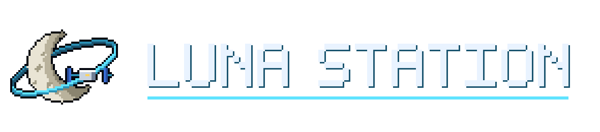

<div align="center">



**A private, local-first pixel-art station where real AI agents do real work.**

</div>

Luna Station is a **private, personal build** derived from the open-source
[StarNet](https://github.com/androoAGI/starnet) harness (MIT). It keeps StarNet's runtime (agents,
tools, MCP, schedules, Night Shift, connectors, voice, ledgers) and its core rule: **the interface
never claims something happened unless the runtime can prove it.** It changes three things:

1. **Identity and art:** its own name, logo, icons, installer art and an original crew of 24
   procedurally drawn pixel characters (`scripts/luna-art/`).
2. **Claude first:** Claude through the Anthropic API is the default provider. Every provider
   card is labelled with how it is paid for, and API billing never happens silently.
3. **Private-build safety:** its own app identifier, data folder and keychain namespace, no
   auto-updater, no managed cloud, and no public release tooling.

Luna Station is not an official StarNet product and not an Anthropic product.

## Claude and your Claude Pro plan

**Claude Pro/Max subscription sign-in is not available in Luna Station.** Anthropic's current
documentation does not allow third-party apps (including Agent SDK apps) to offer claude.ai login
or use subscription rate limits without Anthropic's approval. So this app does not build one, and
it does not borrow Claude Code's credentials. Claude runs through an **Anthropic API key** (billed
per token to your Claude Console account, separate from Pro), or you can use **Local Ollama** for
free. Details and sources: [AUTHENTICATION.md](AUTHENTICATION.md). Provider internals:
[CLAUDE_PROVIDER.md](CLAUDE_PROVIDER.md).

## Features (inherited from StarNet)

| | |
| --- | --- |
| **A crew, not a chatbot** | Agents with classes, personas and loadouts, each with its own workspace, transcript, memory and bounded permissions. Several run at once. |
| **Delegation** | Agents summon specialists and hand off work as real, bounded child runs. |
| **Tools with consent** | Filesystem, shell, web, browser, desktop, notebook, skills and image tools, all behind a capability gate and a consent broker. |
| **MCP** | Attach MCP servers and OAuth connectors to extend what agents can touch. |
| **Tasks and briefs** | Tasks, Task Briefs (one concrete clarifying question), and deliverables in the OUTBOX as real files. |
| **Recipes, skills, schedules** | Multi-step recipes, reusable skills, cron schedules (opt-in). |
| **Night Shift** | Unattended work inside an explicit leash; every away-action is logged and reviewable. |
| **Connectors** | Telegram, Discord, Slack, Signal and Matrix. |
| **Voice** | Push-to-talk dictation and a station voice. |
| **Real ledgers** | Run history, tokens, list-price spend and budgets, persisted on disk. |

## Run it

- **Windows desktop:** see [INSTALL.md](INSTALL.md), which covers building the installer on
  GitHub Actions or on your PC.
- **From source (any OS):** Node.js 18+ (22 recommended), then
  ```bash
  npm ci
  npm start            # sidecar + UI on http://127.0.0.1:8787
  ```
  Open the page, then pick a provider in **SETTINGS → PROVIDERS**.

## Run free with a local model

No key, no account, no bill: install [Ollama](https://ollama.com), pull a model
(`ollama pull llama3.1`), and pick **LOCAL OLLAMA**, either on the first-run brain screen or later in
**SETTINGS → PROVIDERS**. Luna Station talks to Ollama on `127.0.0.1:11434` and reports it ready only
once it can list your local models. Local models are smaller than the cloud ones, so expect slower
and rougher work on long tasks.

## Documentation

| | |
| --- | --- |
| [INSTALL.md](INSTALL.md) | Build/install on Windows, first-run checklist, troubleshooting |
| [AUTHENTICATION.md](AUTHENTICATION.md) | Exactly how each provider authenticates and who pays |
| [CLAUDE_PROVIDER.md](CLAUDE_PROVIDER.md) | The Claude adapter: models, streaming, tools, thinking, limits |
| [ARCHITECTURE.md](ARCHITECTURE.md) | Processes, run lifecycle, providers, data on disk, subsystems |
| [PRIVACY.md](PRIVACY.md) | What leaves your machine and when |
| [CODE_MAP.md](CODE_MAP.md) | Upstream file-level map |

Most files in `docs/`, `qa/` and `website/` are StarNet's own design history, QA records and public
site. They are kept for reference and are not Luna Station documentation.

## Testing

```bash
npm run test:fast          # unit/contract gate
npm run test:http          # live sidecar HTTP/E2E suite (includes test/luna-claude-provider.e2e.test.js)
npm test                   # both
```

Browser-driven tests need Chrome/Chromium; set `SKYNET_CHROME` to its path if it isn't found.

## License and attribution

The code is MIT-licensed; see [LICENSE](LICENSE) (Copyright © 2026 Andrew Sims, the StarNet
author). Third-party notices are in [NOTICE.md](NOTICE.md).

StarNet's name, logo, crew sprites and brand are not licensed with the code. Luna Station replaces
the name, logo, icons, installer art and every crew sprite with original work. **Still upstream
art:** the station environment itself (room shells, floors, furniture and machine props in
`frontend/assets/industrial/` and `frontend/assets/furniture/`). Replace these before sharing this
build with anyone. See NOTICE.md.
